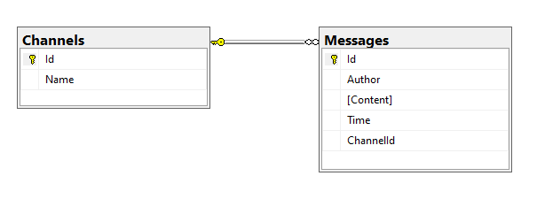

# Yeet-Chat
Online chat application for the M120 and M226B
## Database
Here is a image of the Databse schema:

## API
ASP.Net Core API with the MVVM Pattern
### Controllers
There are is only one controller with two methods
#### Channel Controller
- HTTP GET - Fetch all channels
- HTTP GET - Fetch specific channel with messages

### Services:
#### Channel Hub
Realtime functionality with SignalR

- Join (string channelId)
- Leave (string channelId)
- Send (string channelId, string author, string content)

#### Message Service
Used to save a message to the database and return it to the Channel Hub for the group response.
